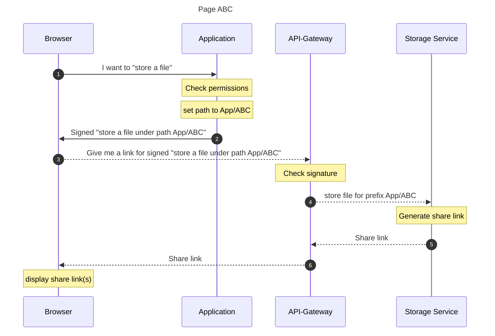
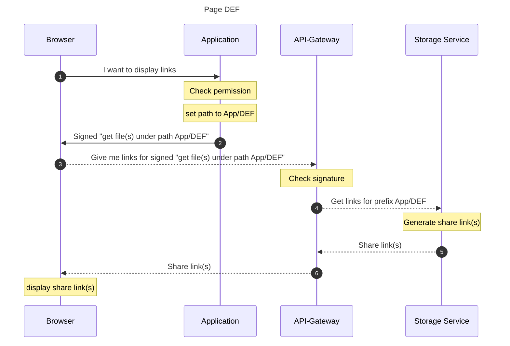

# Sequence Diagrams

Storing and retrieving files from a *blob* storage service requires some well defined steps.

## Store a file

On page *ABC* the user want to store a file in the context of the page.

## Retrieve all files

On page *DEF* the user wants to get a list of all files in the context of this page.

